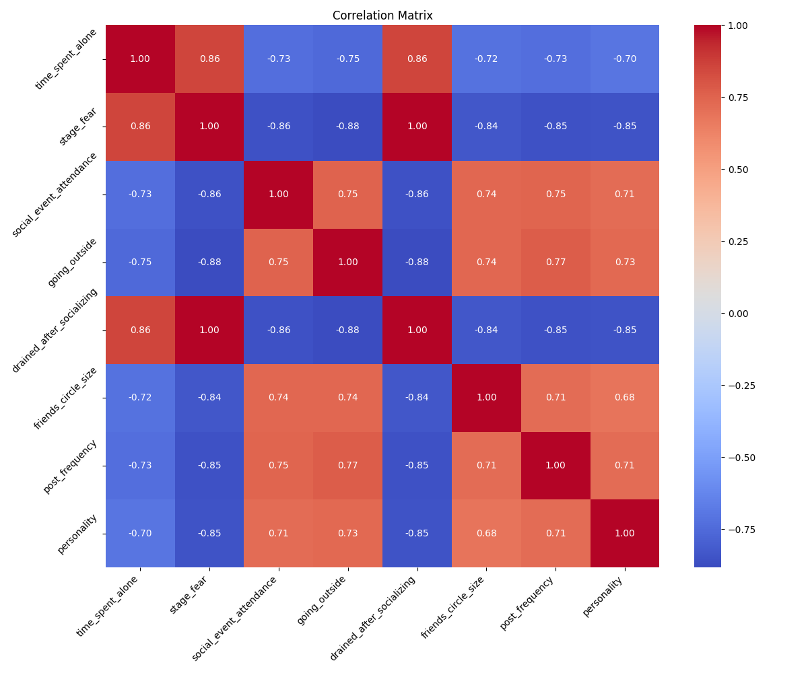
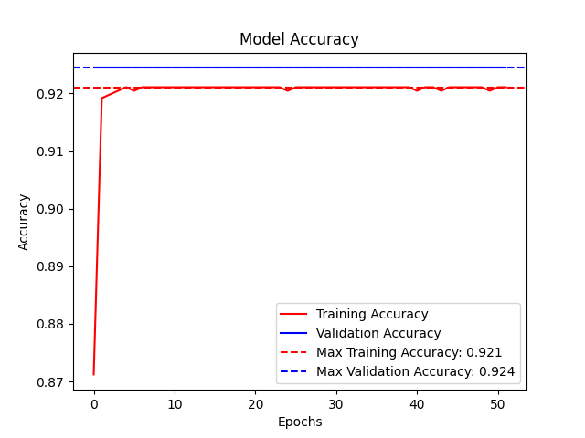
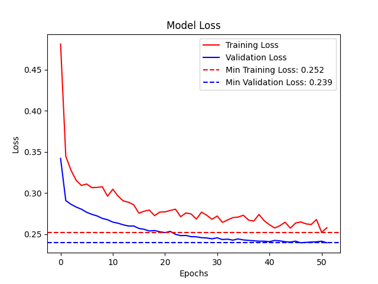

# Extrovert vs Introvert Prediction using Deep Learning

This project is a part of my **deep-learning-projects** repository, where I experiment with small deep learning tasks. In this project, I built a binary classification model to detect if a person is an extrovert or introvert based on behavioral data.

## 📊 Dataset

- **Source:** [Kaggle Dataset by rakeshkapilavai](https://www.kaggle.com/datasets/rakeshkapilavai/extrovert-vs-introvert-behavior-data)
- **Description:**  
  Personality traits like extroversion and introversion shape how individuals interact with their social environments. This dataset provides insights into behaviors such as time spent alone, social event attendance, and social media engagement, enabling applications in psychology, sociology, marketing, and machine learning.
  
- **Dataset Details:**
  - **Size:** 2,900 rows, 8 columns
  - **Features:**
    - `Time_spent_Alone`: Hours spent alone daily (0–11).
    - `Stage_fear`: Presence of stage fright (Yes/No).
    - `Social_event_attendance`: Frequency of social events (0–10).
    - `Going_outside`: Frequency of going outside (0–7).
    - `Drained_after_socializing`: Feeling drained after socializing (Yes/No).
    - `Friends_circle_size`: Number of close friends (0–15).
    - `Post_frequency`: Social media post frequency (0–10).
    - `Personality`: Target variable (Extrovert/Introvert).

- **Feature Transformed:**
  - All column names were renamed with lowercase style.
  - `Stage_fear` column values changed: `1` (Yes) and `0` (No)
  - `Drained_after_socializing` column values changed: `1` (Yes) and `0` (No)
  - `Personality` column values changed: `1` (Extrovert) and `0` (Introvert)

## 🧠 Model Architecture

The model is a simple **fully-connected neural network** built using **TensorFlow/Keras**:

- **Model Architecture:**
    | Layer (type) | Output Shape | Param # |
    |--------------|---------------|---------|
    | dense (Dense) | (None, 32)   | 256     |
    | dropout (Dropout) | (None, 32)   | 0     |
    | dense_1 (Dense) | (None, 16) | 528     |
    | dropout_1 (Dropout) | (None, 16)   | 0     |
    | dense_2 (Dense) | (None, 1)  | 17      |

- **Total Trainable params:** 801
- **Activation Functions:** ReLU for hidden layers, Sigmoid for the output layer.
- **Loss Function:** Binary Crossentropy
- **Optimizer:** Adam
- **Early Stopping:**
  - Monitor: validation loss
  - Patience: 5

## 📈 Results and Visualizations

**Training was early stopped after epoch 52, with model weights restored from the best epoch (47).**

* **Best Training Accuracy:** 92.62%
* **Best Validation Accuracy:** 92.44%  

The following plots provide additional insights:

- **Correlation Matrix:**  
  

- **Model Accuracy over Epochs:**  
  

- **Model Loss over Epochs:**  
  

---

**Feel free to explore the code and try it out!**  
If you have any suggestions, ideas, or questions, feel free to raise an issue or contribute!